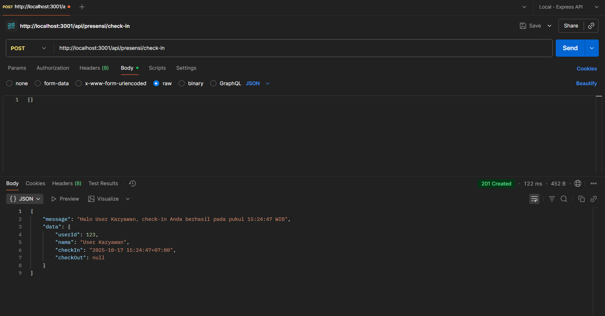
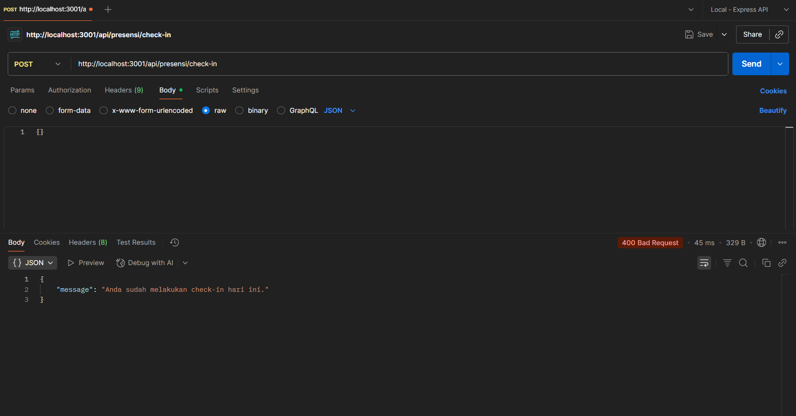
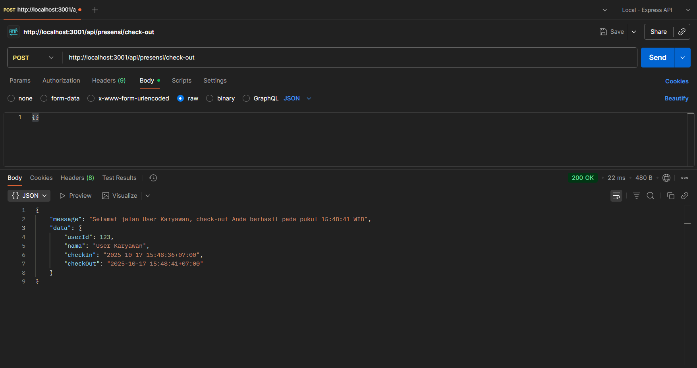
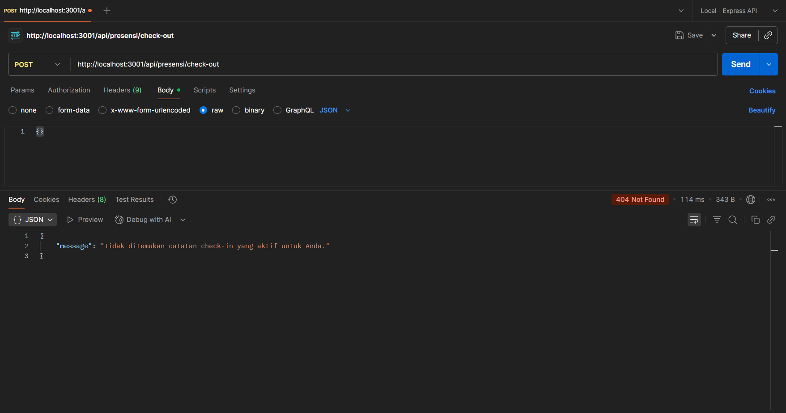
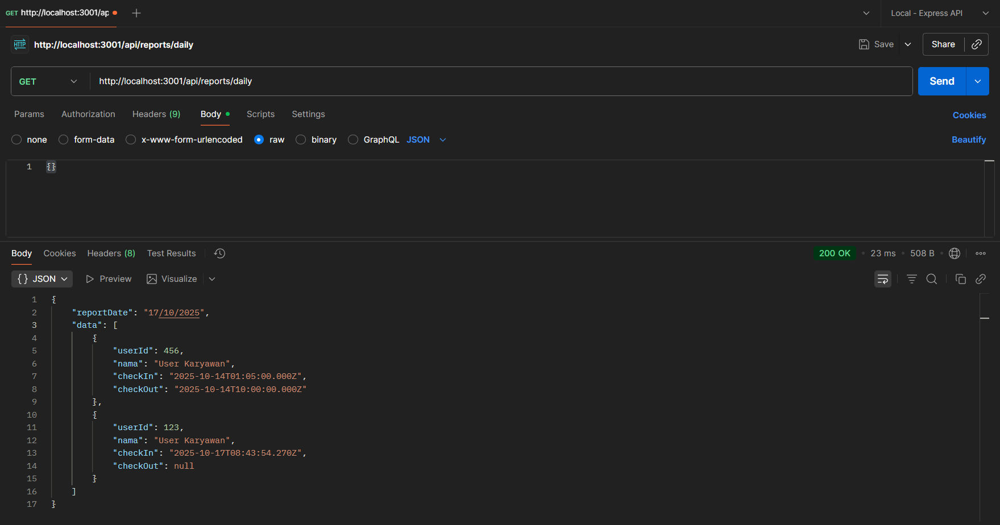

# Tugas 3

## 1) `POST /api/presensi/check-in` (berhasil)

## 2) `POST /api/presensi/check-in` (gagal karena dilakukan lebih dari 1×)

## 3) `POST /api/presensi/check-out` (berhasil)

## 4) `POST /api/presensi/check-out` (gagal karena belum melakukan check-in)

## 5) `GET /api/reports/daily` (admin)

